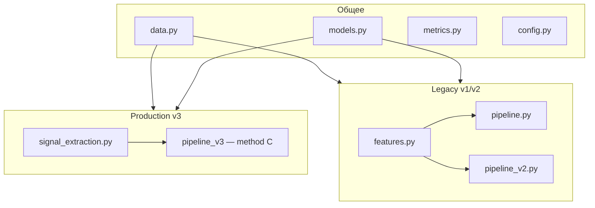

# Архитектурный аудит кодовой базы

**Дата:** 2026-05-23  
**Проект:** offline ML для Kaggle, ~24 Python-файла в `src/` + скрипты + ноутбуки.  
**Продакшен:** v3, метод C (`signal_extraction` + `method_c_gmm2_low_confidence`, score **0.44571**).  
**Проблема:** в репозитории живут **три поколения пайплайнов** с пересекающейся логикой, разрозненными путями и устаревшей документацией.

> Отчёт — основа для последующего рефакторинга. Изменения в коде **не вносились** на момент сохранения.

---

## Карта модулей



| Модуль | Роль | Кто использует |
|--------|------|----------------|
| `config.py` | константы, пути | везде |
| `data.py` | загрузка CSV | везде |
| `features.py` | признаки по **всей** волне (500 bins) | v1, v2 |
| `signal_extraction.py` | признаки по **окну** (3σ, Description) | v3 |
| `models.py` | GMM, two-stage, remap | v1, v2, v3 |
| `pipeline.py` | v1: two-stage GMM + Isolation Forest | архив |
| `pipeline_v2.py` | v2: quantile GMM-3 | архив |
| `pipeline_v3.py` | v3: гипотезы A/B/C | **продакшен** |

**Структурный разрыв:** v1/v2 — классы (`fit_predict`, `save_artifacts`); v3 — набор функций. Единого интерфейса нет.

---

## 1. Дубли кода

### 1.1 Два экстрактора признаков

`features.py` и `signal_extraction.py` считают одни и те же величины (peak, charge, PSD, decay, SNR, tail), но **по разной физике**:

| | `features.py` | `signal_extraction.py` |
|--|---------------|------------------------|
| Заряд | сумма **всех 500** отсчётов | сумма **окна** после 3σ |
| Конец импульса | от argmax до конца массива | до первого ≤ μ+3σ |
| Колонок | 8 (есть argmax) | 7 |

Константы PSD (`offset=3`, `short_len=30`, `decay=0.40`) продублированы, но не вынесены в общее место.

### 1.2 GMM-3 + QuantileTransformer + remap

Одинаковый блок в `pipeline_v2._fit_gmm_balanced` и `pipeline_v3.method_b_description_gmm3` — отличается только источник признаков.

### 1.3 Remap меток по заряду

В `method_c_gmm2_low_confidence` (`pipeline_v3.py`, строки 89–100) логика «у кого меньше charge → класс 0» **переписана вручную**, хотя есть `remap_labels_physics()` в `models.py`.

### 1.4 Запись submission

Три копии одного и того же:

- `pipeline.py` → `save_submission`
- `pipeline_v2.py` → `save_submission`
- `pipeline_v3.py` → `labels_to_submission`

### 1.5 Сохранение артефактов

`save_artifacts` + `joblib.dump` + JSON-метрики — одинаковый шаблон в v1 и v2.

### 1.6 Скрипты экспериментов

`run_experiments.py`, `run_experiments_v2.py`, `run_experiments_v3.py` — один каркас: load → grid → score → report JSON. Меняются только сетки и функции оценки.

### 1.7 Генераторы ноутбуков

Три файла `generate_notebooks*.py` повторяют `_md`, `_code`, `_analysis` и nbformat-обвязку.

### 1.8 Двойное чтение CSV

`pipeline_v3._load_raw_col2` читает CSV через pandas **отдельно** от `data.load_waveforms`, минуя валидацию и drop колонок.

---

## 2. Мёртвый и лишний код

| Что | Где | Почему лишнее |
|-----|-----|---------------|
| `agreement_rate`, `adjusted_rand` | `metrics.py` | нигде не вызываются |
| `RAW_COLUMNS = 505` | `config.py` | не используется |
| `resolve_data_path()` Colab-fallback | `data.py` | все вызовы идут с явным `DATA_PATH` |
| `scipy` | `requirements.txt` | нет `import scipy` в коде |
| `build_clustering_matrix`, PCA | `features.py` | только v1, не продакшен |
| `fit_two_stage_gmm`, `TwoStageConfig` | `models.py` | только v1 |
| `compare_methods`, `compare_v2_methods` | pipeline v1/v2 | только архивные ноутбуки |

**Тесты:** нет unit-тестов для `features.py`, `signal_extraction.py`, `models.py`; не покрыты `agreement_rate` / `adjusted_rand`.

---

## 3. Разрозненность путей и конфигурации

Централизовано в `config.py`:

```python
REPO_ROOT = Path(__file__).resolve().parents[2]
EXPERIMENTS_DIR = REPO_ROOT / "Разработка" / "Эксперименты"
DATA_PATH = REPO_ROOT / "Run200_Wave_0_1.txt"
ARTIFACTS_DIR = REPO_ROOT / "artifacts"
SUBMISSION_PATH = EXPERIMENTS_DIR / "submission.csv"
```

Разбросано по модулям:

| Константа | Где | Значение | Факт на диске |
|-----------|-----|----------|---------------|
| `SUBMISSION2_PATH` | `pipeline_v2.py` | **корень** репо | `Разработка/Эксперименты/submissions/submission2.csv` |
| `SUBMISSION4_PATH` | `tune_method_c.py` | **корень** репо | `submissions/submission4.csv` |
| `_EXPERIMENTS` | `pipeline_v3.py` | дублирует `EXPERIMENTS_DIR` | — |
| `ARTIFACTS_V2/V3` | pipeline v2/v3 | `artifacts_v2/`, `artifacts_v3/` | **папок нет** (только `artifacts/`) |

**Два уровня сабмитов:** корень `Эксперименты/` (`submission.csv`, `3`, `3c`) vs подпапка `submissions/` (`2`, `3a`, `3b`, `4`) — единого правила нет.

---

## 4. Устаревшая документация (3b vs 3c)

Код копирует **3c** как основной:

```python
shutil.copy(SUBMISSION3C_PATH, SUBMISSION3_PATH)
shutil.copy(SUBMISSION3C_PATH, SUBMISSION_PATH)
```

Но docstring и генераторы всё ещё говорят **3b**:

- `pipeline_v3.run_all_v3`: `"submission3 (=3b)"`
- `run_experiments_v3.py`: `"copy of 3b"`
- `generate_notebooks_v5_v6.py`: `"submission3.csv | копия B"`
- `Рекомендации_улучшения_Kaggle.md`: `"копия 3b"`

`notebook_6` уже на методе C, а `generate_notebooks_v5_v6.build_nb6()` генерирует метод **B** — **генератор и ноутбук рассинхронизированы**.

---

## 5. Дублирование script ↔ notebook

| Скрипт | Ноутбук | Пересечение |
|--------|---------|-------------|
| `run_experiments_v3.py` | `notebook_5` | оба вызывают `run_all_v3()` |
| `run_experiments.py` | `notebook_1` | grid + compare |
| `run_experiments_v2.py` | `notebook_3` | v2 pipeline |
| — | `notebook_2`, `notebook_4` | только load + inference |

**8 ноутбуков** повторяют один и тот же boilerplate:

```python
ROOT = Path.cwd()
sys.path.insert(0, str(ROOT / "src"))
```

v1–v2 ноутбуки в `Разработка/Эксперименты/`, v3 — в корне. Генератор v1–v2 пишет ноутбуки **в корень**, а в git они лежат в `Эксперименты/` — повторная генерация создаст дубликаты.

**Пути к скриншотам:** генераторы ищут `Разработка/kaggle_leaderboard_*.png`, файлы лежат в `Разработка/Эксперименты/`.

---

## 6. `__init__.py` не отражает реальность

Экспортируются все три поколения без указания, что канон — v3-C:

```python
from sygnal_clustering.pipeline import SygnalClusteringPipeline
from sygnal_clustering.pipeline_v2 import SygnalClusteringPipelineV2
from sygnal_clustering.pipeline_v3 import run_all_v3
```

---

## Рекомендации по приоритету

### P0 — ясность продакшена

1. Оформить v3-C как единственный production-модуль; v1/v2 — в `legacy/` или только в архиве ноутбуков.
2. **Все пути** — в `config.py` (сабмиты, артефакты, скриншоты).
3. Исправить docstring 3b→3c и синхронизировать `generate_notebooks_v5_v6` с `notebook_6`.

### P1 — убрать дубли логики

4. Один экстрактор признаков (`signal_extraction` как канон).
5. Общие хелперы: `fit_gmm_quantile_3`, `write_submission`, `save_experiment_report`.
6. В method C вызывать `remap_labels_physics` вместо inline-remap.
7. Везде `load_waveforms()` без аргумента — чтобы работал Colab-fallback.

### P2 — уборка

8. Удалить неиспользуемое из `metrics.py`, `RAW_COLUMNS`, `scipy`.
9. Слить три `generate_notebooks*.py` в один с параметром версии.
10. Один CLI вместо трёх `run_experiments*.py` (или оставить только v3).

### P3 — гигиена

11. Unit-тесты на `signal_extraction`, `remap_labels_physics`.
12. Узкий public API в `__init__.py`; legacy — отдельный namespace.
13. Выровнять пути сабмитов 2/4 с папкой `submissions/`.

---

## План работ (чеклист для рефакторинга)

- [x] P0.1 — production module / legacy split
- [x] P0.2 — централизация путей в `config.py`
- [x] P0.3 — docstring 3b→3c, sync generators
- [x] P1.4 — единый экстрактор признаков (legacy `features.py`, production `signal_extraction.py`)
- [x] P1.5 — shared helpers (`io.py`, `fit_gmm_quantile_3`)
- [x] P1.6 — `remap_labels_physics` в method C
- [x] P1.7 — `load_waveforms()` без явного path (production + legacy)
- [x] P2.8 — dead code cleanup (`metrics`, `scipy`)
- [x] P2.9 — merge notebook generators (production `generate_notebooks.py`)
- [x] P2.10 — consolidate experiment scripts (`run_experiments.py` = v3)
- [x] P3.11 — unit tests (`test_signal_extraction.py`)
- [x] P3.12 — narrow `__init__.py` exports
- [x] P3.13 — align submission paths on disk (`config.py`)

---

## Итог

Репозиторий ведёт себя как **три форка в одном**: v1 (two-stage GMM), v2 (balanced quantile), v3 (Description + uncertain). Продакшен — одна функция (`method_c`), но ~60% кода и инфраструктуры обслуживает архив.

**Главные источники «грязи»:**

- два экстрактора признаков с разной физикой;
- три пайплайна с копипастой submission/artifacts/GMM;
- пути и docstring не совпадают с диском и с Kaggle-результатами;
- скрипты, ноутбуки и генераторы дублируют друг друга и расходятся.

Consolidation до **одного пайплайна + одного экстрактора + централизованного config** сократит поверхность поддержки примерно вдвое **без изменения Kaggle-результата**, если method C останется неизменным.
